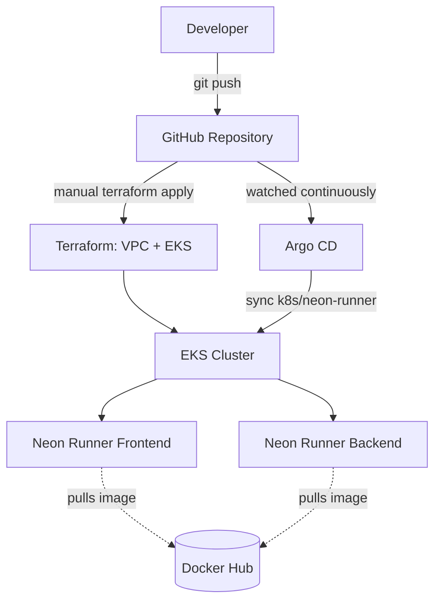

# GitOps-Driven Kubernetes Platform

A GitOps deployment pipeline for a containerized app ("Neon Runner"), built with **Terraform (AWS EKS + VPC)**, **Helm**, and **Argo CD**, with an optional local **kind** cluster for development. Git is the single source of truth: application manifests live in this repo, and Argo CD continuously syncs the cluster state to match it.

> This README describes exactly what is implemented in this repository today. Planned-but-not-yet-built pieces (CI/CD, image scanning, monitoring/alerting) are listed under [Roadmap](#roadmap--future-improvements), not presented as working features.

---

## Scope

This repository covers **infrastructure and deployment only** — provisioning the cluster (Terraform), packaging the app (Helm), and continuously deploying it (Argo CD). Application source code, its Dockerfile, and its CI/CD pipeline live in a separate repository: **[Neon-runner](https://github.com/shiveshrana/Neon-runner)**.

This split is intentional: it keeps "how the app is built" independent from "how the platform is deployed," which is a common real-world GitOps pattern.

## Overview

This project demonstrates how to run a small two-tier application (a frontend and a backend) on Kubernetes using GitOps principles instead of manual `kubectl apply` commands:

- Infrastructure (a VPC and an EKS cluster) is defined as code with **Terraform**.
- The application is packaged as a **Helm chart**.
- An **Argo CD** `Application` resource points at this repo/chart and continuously reconciles the live cluster to match it — including automatic pruning and self-healing if someone manually edits a live resource.
- A **kind** (Kubernetes-in-Docker) config is included so the same Helm chart/Argo CD workflow can be exercised locally without provisioning real AWS infrastructure.

It exists as a portfolio piece to demonstrate Infrastructure as Code, Kubernetes packaging, and GitOps deployment patterns end to end.

**Who it's for:** developers or reviewers who want to see a minimal but complete GitOps loop — provisioning, packaging, and continuous reconciliation — without unnecessary scaffolding.

## Key Features

- **Infrastructure as Code** — AWS VPC and EKS cluster provisioned via the official `terraform-aws-modules/vpc` and `terraform-aws-modules/eks` modules.
- **Helm packaging** — the Neon Runner frontend and backend are templated as a single Helm chart (`k8s/neon-runner`) with configurable replica counts, images, probes, and service types.
- **GitOps continuous delivery** — an Argo CD `Application` manifest (`argocd-neon-runner.yaml`) syncs this repo's `k8s/neon-runner` path automatically, with `prune: true` and `selfHeal: true`.
- **Local dev parity** — a `kind` cluster definition (3 nodes: 1 control-plane, 2 workers) lets you test the exact same Helm chart and Argo CD setup on your laptop before touching AWS.
- **Health checks** — readiness and liveness probes configured for both services.

## Architecture



**How it fits together today:**

1. A human runs Terraform to create (or a `kind` command to create locally) a Kubernetes cluster.
2. Argo CD is installed into that cluster (manually, following the steps in [MANUAL.md](MANUAL.md) — this repo does not yet include an Argo CD installation manifest).
3. The `argocd-neon-runner.yaml` `Application` resource is applied once; from then on, Argo CD watches this Git repository and keeps the `neon-runner` namespace in sync with the `k8s/neon-runner` Helm chart.
4. The Helm chart deploys two Deployments/Services (frontend, backend), pulling pre-built images (`shivesh8/neon-runner-backend`, `shivesh8/neon-runner-frontend`) from Docker Hub.

The images themselves are built, tested, and pushed by the CI/CD pipeline in the **[application repo](https://github.com/shiveshrana/Neon-runner)** — this repo only consumes the resulting tag. There is no build/test/scan step in this repo by design (see [Scope](#scope)).

## Technology Stack

| Technology | Purpose |
|---|---|
| Terraform | Provisions AWS VPC and EKS cluster |
| terraform-aws-modules/vpc | VPC, subnets, NAT gateway |
| terraform-aws-modules/eks | EKS control plane + managed node group |
| AWS (EKS, VPC, EC2) | Cloud infrastructure target |
| kind | Local Kubernetes cluster for development/testing |
| Helm | Packaging/templating for the Neon Runner app |
| Argo CD | GitOps continuous delivery / reconciliation |
| Kubernetes | Container orchestration |
| Docker Hub | Hosts the pre-built application images |

## Project Structure

```text
gitops-k8s-platform/
├── README.md                     # This file
├── MANUAL.md                     # Full operational guide (setup → deploy → verify → stop)
├── DESTROY.md                    # Full teardown guide (reverse of MANUAL.md)
├── LICENSE                       # Project license
├── .gitignore                    # Excludes Terraform state/cache, local artifacts
├── .gitattributes                # Line-ending normalization
├── argocd-neon-runner.yaml       # Argo CD Application: syncs k8s/neon-runner from this repo
├── kind-config.yml                # Local 3-node kind cluster definition
├── k8s/
│   └── neon-runner/                # Helm chart for the application
│       ├── Chart.yaml
│       ├── values.yaml             # Image repos/tags, replica counts, probes, service types
│       ├── .helmignore
│       └── templates/
│           ├── backend-deployment.yaml
│           ├── backend-service.yaml
│           ├── frontend-deployment.yaml
│           └── frontend-service.yaml
├── terraform/
│   ├── providers.tf                # AWS provider + required Terraform version
│   ├── variables.tf                 # aws_region, cluster_name
│   ├── main.tf                      # VPC + EKS module calls
│   └── outputs.tf                   # (currently empty — see Roadmap)
└── scripts/
    ├── deploy.sh                   # Optional helper: terraform apply + kind create (local mode)
    └── destroy.sh                  # Optional helper: reverse of deploy.sh
```

## Prerequisites

| Tool | Notes |
|---|---|
| [Terraform](https://developer.hashicorp.com/terraform/downloads) | `>= 1.5.0` (enforced in `terraform/providers.tf`) |
| AWS CLI + AWS account | Only needed for the real-cloud (EKS) path |
| [kind](https://kind.sigs.k8s.io/) | Only needed for the local-cluster path |
| [Helm](https://helm.sh/docs/intro/install/) | `v3.x` |
| `kubectl` | Compatible with Kubernetes 1.3x |
| [Argo CD CLI/manifests](https://argo-cd.readthedocs.io/en/stable/getting_started/) | Installed separately into the cluster |
| Docker | Required by `kind` |

Provider versions actually pinned in `terraform/.terraform.lock.hcl`: `hashicorp/aws 6.63.0`, `hashicorp/cloudinit 2.4.0`, `hashicorp/null 3.3.1`, `hashicorp/time 0.14.1`, `hashicorp/tls 4.4.0`.

## Installation

```bash
git clone https://github.com/shiveshrana/gitops-k8s-platform.git
cd gitops-k8s-platform
```

Then choose a path in [MANUAL.md](MANUAL.md):
- **Path A — Local (kind):** no cloud cost, fastest way to see the GitOps loop work.
- **Path B — AWS (Terraform/EKS):** provisions real AWS infrastructure and incurs cost.

## Configuration

There are no secrets or `.env` files in this project. The only configuration points are:

- `terraform/variables.tf` — `aws_region` (default `ap-south-1`) and `cluster_name` (default `gitops-platform`). Override with a `terraform.tfvars` file (git-ignored) or `-var` flags — never edit these defaults with real account-specific values and commit them.
- `k8s/neon-runner/values.yaml` — image repository/tag, replica counts, service types, and probe settings for the Helm chart.
- `argocd-neon-runner.yaml` — `spec.source.repoURL` currently points at `https://github.com/shiveshrana/gitops-k8s-platform.git`. If you fork this repo, update this field to your own fork's URL, or Argo CD will keep syncing from the original.

AWS credentials for Terraform should come from your standard AWS credential chain (`aws configure`, environment variables, or an SSO profile) — never hardcode them in `.tf` files.

## Deployment

See [MANUAL.md](MANUAL.md) for full copy-pasteable steps. In short:

```bash
# AWS path
cd terraform
terraform init
terraform apply

# Local path
kind create cluster --config kind-config.yml

# Either path, once a cluster + Argo CD are ready
kubectl apply -f argocd-neon-runner.yaml
```

## Usage

```bash
# Check Argo CD sync status
kubectl get applications -n argocd

# Check the app
kubectl get pods -n neon-runner
kubectl get svc -n neon-runner
```

## Verification

```bash
kubectl get pods -n neon-runner            # both deployments should be Running/Ready
kubectl get application neon-runner -n argocd -o wide   # Synced + Healthy
```

## Testing

Application-level tests live in the **[application repo](https://github.com/shiveshrana/Neon-runner)**. This repo has no application code to test — the only verification here is confirming the cluster reaches the desired state (see [Verification](#verification)).

## CI/CD

Building the application images and running tests/scans is handled in the **[application repo](https://github.com/shiveshrana/Neon-runner)**, not here. This repo picks up wherever that pipeline publishes an image to Docker Hub: update the tag in `k8s/neon-runner/values.yaml`, and Argo CD will roll it out on the next sync (or immediately, if you enable image-based auto-updates — not currently configured here).

## Infrastructure

`terraform/main.tf` provisions:
- A VPC (`terraform-aws-modules/vpc/aws ~> 6.0`) across 3 AZs in `ap-south-1`, with public + private subnets and a single NAT gateway.
- An EKS cluster (`terraform-aws-modules/eks/aws ~> 21.0`) with one managed node group (`t3.small`, 1–2 nodes).

`terraform/outputs.tf` is currently empty — no cluster endpoint/kubeconfig outputs are exposed. See [Roadmap](#roadmap--future-improvements).

## Security

- No secrets, credentials, or `.env` files are stored in this repository.
- Terraform state is excluded via `.gitignore` and must never be committed (it can contain sensitive resource metadata).
- AWS credentials are expected to come from the operator's local environment/CLI profile, never from files in this repo.
- The Argo CD `Application` uses `prune: true` / `selfHeal: true` — be aware this means Argo CD will delete cluster resources not defined in Git, and revert manual `kubectl` edits.

## Monitoring / Logging

Not currently implemented. See [Roadmap](#roadmap--future-improvements).

## Troubleshooting

| Symptom | Likely cause | Fix |
|---|---|---|
| `terraform apply` fails on auth | AWS credentials not configured | Run `aws configure` or set `AWS_PROFILE` |
| Argo CD app shows `OutOfSync` forever | `repoURL` in `argocd-neon-runner.yaml` still points at the upstream fork | Update `spec.source.repoURL` to your fork |
| Pods stuck `ImagePullBackOff` | Docker Hub image tag missing/renamed | Check `shivesh8/neon-runner-backend`/`frontend` tags in `values.yaml` |
| `kind create cluster` fails | Docker not running | Start Docker Desktop/daemon first |

## Cleanup

See [DESTROY.md](DESTROY.md) for the full, ordered teardown procedure.

## Destroy

Full instructions, including AWS resource teardown, live in [DESTROY.md](DESTROY.md). **Do not skip this if you provisioned the AWS path** — an EKS cluster and NAT gateway will continue to incur cost until destroyed.

## Using This as a Deployment Template for Your Own App

The Terraform (VPC/EKS) and the overall Argo CD/GitOps flow are already generic — they don't reference "Neon Runner" anywhere and work for any containerized app. The Helm chart, however, currently hardcodes `neon-runner` in a few places, so treat it as a **reference implementation to fork and rename**, not a zero-edit generic chart. To point this whole pipeline at your own app:

1. **Fork this repo** (or copy it into a new one).
2. **Rename the chart:**
   - `k8s/neon-runner/` → `k8s/<your-app>/`
   - Inside `Chart.yaml`, update `name`.
   - In each template under `templates/`, replace the hardcoded `neon-runner-backend` / `neon-runner-frontend` names/labels with your own (or reduce to a single service if you don't have a frontend/backend split).
3. **Point at your own images** — in `values.yaml`, set `backend.image.repository` / `frontend.image.repository` (and tags) to whatever your CI pipeline in your application repo publishes.
4. **Update the Argo CD `Application`** (`argocd-neon-runner.yaml` — rename this file too):
   - `metadata.name`
   - `spec.source.repoURL` → your fork's URL
   - `spec.source.path` → `k8s/<your-app>`
   - `spec.destination.namespace`
5. **Adjust Terraform variables** (`terraform/variables.tf`) — `cluster_name` and `aws_region` as needed. The VPC/EKS module calls themselves don't need to change.
6. **Set up your own CI/CD** in your application's repo to build, test, scan, and push images — this repo only consumes a published image tag, it doesn't build one.

## Roadmap / Future Improvements

These are realistic next steps for this repo specifically (build/test/scan pipelines belong in the application repo, not here):
- Terraform outputs (cluster endpoint, kubeconfig command) in `terraform/outputs.tf`.
- Prometheus + Grafana for metrics, and a Discord webhook for alerting, on the cluster this repo provisions.
- Image-based auto-sync in Argo CD (e.g. Argo CD Image Updater) so a new tag from the application repo's CI deploys automatically instead of requiring a manual `values.yaml` edit.
- Genericizing the Helm chart's resource names so it's usable without a fork/rename (currently `neon-runner` is hardcoded — see [above](#using-this-as-a-deployment-template-for-your-own-app)).

## Lessons Learned / Skills Demonstrated

- Infrastructure as Code with Terraform and community modules (VPC, EKS).
- Kubernetes application packaging with Helm (values-driven templating, probes, services).
- GitOps deployment patterns with Argo CD (auto-sync, prune, self-heal).
- Local-vs-cloud environment parity using `kind`.
- Git hygiene: keeping generated/stateful artifacts (Terraform cache/state) out of version control.

## License

See [LICENSE](LICENSE).

## Author

**Shivesh Rana** — [github.com/shiveshrana](https://github.com/shiveshrana)
